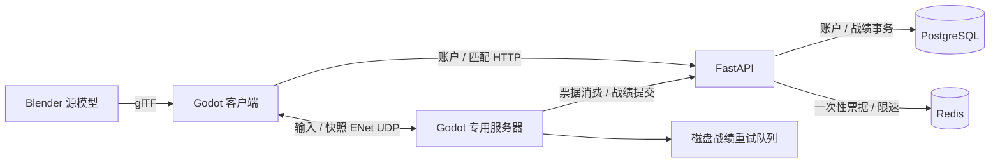

# 架构与约束

## 客户端与模拟

`game.gd` 编排回合与网络；`actor.gd` 处理角色状态、碰撞移动和弹药；`world.gd` 确定性创建地图与补给表现；`interface.gd` 处理 UI；`sound.gd` 生成原创枪声。`character_animation.gd` 从实际速度、落地、蹲伏、换弹和生命状态选择骨骼动作，并添加上身瞄准。角色动画片段由 `tools/build_operator.py` 在 Blender 中生成、烘焙并导出；碰撞体不依赖动画根运动。专用服务器不播放表现动画。

本地玩家另行实例化 `first_person.glb`（5 骨骼、单网格、3 材质、4 动作），其他角色不分配这套手臂。`first_person.gd` 按服务器的换弹/投掷/治疗剩余时间采样动作，移动弹匣，插值持枪与瞄准姿态，并添加开火回弹与移动起伏。它不调用任何消耗或伤害逻辑。`tools/build_viewmodel.py` 可独立重建资源与 `art/first_person.blend`，完整 `build_assets.py` 也包含该步骤。瞄具对齐与真实蒙皮顶点运动通过实际 OpenGL 测试；手指握持、武器专属动作和近墙武器表现仍需打磨。

`sound.gd` 确定性合成 17 类原始 PCM 音效，脚步有三个变化版本。移动速度与实际位移共同触发步距累计，避免静止校正或瞬移误响；落地、换弹、治疗等由状态边沿驱动，初次收到角色快照只建立基线。动态角色状态离开 roster 后清理。环境碰撞体提供表面标签，道路/草地分类使用真实地面射线。

空间声音使用显式 AudioListener3D 跟随当前摄像机，包含观战；声音创建时检查直达路径，实体遮挡降低 9dB 并设置 1500Hz 衰减滤波。同时最多 48 个活动声音，按优先级回收，低优先级脚步不能挤掉全部枪声。被回收节点立即停止播放，保留父节点归属直到延迟释放，避免退出时出现孤立对象。音量变化更新现有声音，离开/重建回合停止声音并清空采样状态。命中/受击提示依然来自私有权威反馈。当前没有室内混响、绕射传播或持续环境声混音；单次路径检查不等于完整声学模拟。

音效使用独立总线和 -1dB 限幅，实际混音测试覆盖 48 个同时枪声。窗口关闭、退出按钮和测试客户端退出统一先停声并断开连接，再等待 150ms 释放混音资源后结束进程；专服没有音频资源，无需等待。验证脚本将对象泄漏警告视为失败。

服务器 60Hz 模拟、20Hz 快照；客户端 30Hz 发送输入。输入包含方向、朝向、序列号及操作，没有坐标、生命值或伤害字段。服务器验证字段、数值范围、非有限值、顺序和速率。超过 350ms 未收到有效输入就停止移动和射击。服务器物理射线判定遮挡与命中，按武器间隔与当前弹药执行射击。蹲伏同时更新碰撞体、射击源点和头部判定高度，站起前检查头顶空间。后坐力独立于客户端视角输入保存在服务器，并影响后续射线方向；散布随瞄准、速度及姿态变化。实际伤害之后才发送私人命中/受击反馈，反馈与回合切换使用同一可靠通道保持顺序。

本地玩家以 60Hz 预测移动，复用服务器的碰撞与移动函数。快照带服务器已接受的输入序号；客户端在下一个物理帧恢复权威位置、速度、落地及姿态，丢弃已确认输入并重放未确认移动。历史最多 120 帧，历史缺失、超过 12 米的位置突变或死亡会丢弃历史并回到权威位置。碰撞体立即校正，仅摄像机平滑最多 0.5 米误差，并检查环境遮挡。远端角色继续位置插值。

重放不执行开火、换弹、治疗、投掷、拾取或任何统计结算。服务器仍按自己的 60Hz 时钟模拟，客户端不提交位置或时间步长。输入以 30Hz 传输、服务器保持最新输入，因此序号确认不等于确定性的逐帧命令锁步，移动切换处仍可能出现小幅校正。尚无射击延迟补偿或远端世界历史回滚。ENet 提供连接与传输通道，当前未提供游戏流量加密，也不等同于商业反作弊。

单机在同一进程内运行同一套权威模拟；在线由专用进程运行。环境一致使用固定随机地图种子。角色快照每包最多四人，DEFLATE 压缩后按不超过 1150 字节的目标传输；补给变化使用可靠通道。快照携带回合标识，旧回合数据被丢弃。

## 生命周期

`waiting → lobby(18s) → live(≤300s) → finished(12s) → lobby`

服务器空闲时不运行无人的对局。对局中加入者等待下一轮。断线计为淘汰，保留已参与玩家的结算信息。快照、特效、回合通知和命中反馈发送前同时检查会话与底层 ENet 连接状态；异步票据验证结束后也重新检查连接，避免向正在关闭的连接发包。机器人补满至 16 个名额，采用视线检查和局部避障；当前没有完整导航网格、战术掩体规划或行为树。

专服关闭 `SceneMultiplayer.server_relay`，所有游戏 RPC 都是客户端与权威服务器之间的通信，角色名册由快照维护。此配置也避免 Godot 4.4.1 默认离线通知在多个连接同轮关闭时向已失效 peer 发送内部消息；该路径位于引擎 `SceneMultiplayer::_del_peer`，不经过游戏自己的 `peer_ready` 检查。游戏发送检查额外确认 ENet 通道尚未释放。客户端正常退出先请求断开握手，再释放连接。

`spectator.gd` 在本地角色被权威状态判为死亡后启用独立 SpringArm 摄像机，用球体扫掠避免镜头穿墙。目标来自现有存活角色集合，支持循环切换、环绕和缩放；死亡、移出 roster、回合重建和返回菜单都有清理逻辑。观战没有新增控制目标的 RPC；死亡客户端只发送中性输入。当前自由混战允许淘汰者观看任意存活角色，未实现队伍权限或延迟观战。

回合结束操作有幂等保护，重复调用不会重复入队战绩。伤害按模拟顺序分配淘汰名次；同帧全灭时仍由最后淘汰的第一名获胜，缓存其名称以保证断线移除后结算文案仍与数据库排名一致。

## 数据与权限

- PostgreSQL：`users`、`matches`、`results`。用户密码 Argon2 哈希；昵称标准化；用户 ID 为 UUID。
- JWT：12 小时过期，限定 HS256 与 audience；只在客户端进程内保存。
- Redis：45 秒一次性联机票据；Lua 原子消费；原子限速计数。Redis 仅容器内网可达。
- 战绩：仅持共享服务器密钥的专用服务器可提交；事务写入；唯一 match ID 防重复；按用户 ID 排序获取行锁，避免并发统计丢失。
- 客户端永远不能自己领取击杀或胜场。一个账户只能同时连接当前实例一次。
- 数据库通过 Alembic 版本迁移初始化和升级。原始无版本库先严格比对基线再接管；迁移用 PostgreSQL 事务与 advisory lock 串行化，失败会回滚。模型、连接和 HTTP 服务分离，迁移不依赖 Redis 或账户初始化。当前版本 `0002`。详见 `DATABASE_MIGRATIONS.md`。

API 文档：运行后 `http://127.0.0.1:8000/docs`。`/health` 同时探测数据库与 Redis。`/profile` 和 `/leaderboard` 提供统计读接口；部署菜单展示排行榜；登录后的个人统计也可在该界面读取。局内按住 Tab 查看本局记分板。

## 容错

战绩写入本地临时文件后原子重命名，重启后载入，10 秒重试。API 端幂等使网络重试安全。当前不会将正在进行的回合保存为可恢复快照，服务器崩溃会终止该局；结算队列与数据库状态仍保留。

此实现针对单台服务器和一个房间。分布式匹配、房间自动扩容、跨区路由、版本兼容协商、录像回放、观战、防外挂和高可用发布均未完成。

## 手雷

`grenade.gd` 在服务器运行连续碰撞检测刚体，客户端仅插值其位置。投掷从视点做球形扫掠，避免直接把手雷生成在薄墙另一侧；服务器维护库存、引信、伤害、部分掩体暴露比例与击杀归属。离线使用同一实现。

手雷状态以每批 6 枚压缩快照传输，独立于角色快照；爆炸通知使用可靠通道。客户端记录已经爆炸的 ID，丢弃迟到的位置包，回合 ID 防止上一局手雷出现于新局。对局结束或返回菜单清理剩余手雷。粒子、灯光和声音仅是客户端表现，不参与伤害计算。
